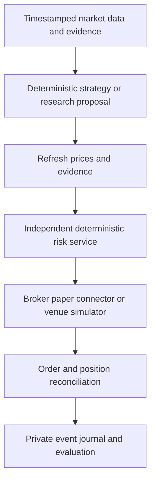

# Architecture and implementation roadmap

## Current boundary

Alpaca data flows through calendar validation into VWAP baseline/filtered experiments and local MLflow. Models are frozen with data, feature/code and policy identities. The current deployable service polls live data and journals shadow decisions; it does not import the broker adapter. Polymarket public snapshots are separate. Research models never control execution policy.

This is a research and shadow service, not unattended paper execution. Separate SQLite stores hold completed research runs, shadow bars/decisions, and paper order intents/recovery state. Export files and the research database do not form one filesystem/database transaction; after an export failure, inspect the journal before retrying. Early closes are recognized at ingestion but explicitly excluded in experiments and skipped by the pinned 16:00 strategy's shadow monitor.

## Target architecture

### Connector contracts

Keep three capabilities separate: market data, research evidence, and order execution. Every data event must retain venue, instrument ID, source timestamp, observation timestamp and provenance. Each connector declares supported asset class, order types, authentication needs, and whether execution is simulated. Unknown capabilities fail closed.

Public discovery is not executable pricing. Before Polymarket simulation, collect CLOB snapshots and updates, outcome token IDs, tick/minimum sizes, fee rules, lifecycle status and resolution rules. Preserve raw payloads for schema/version changes. Current Gamma discovery is a bounded single page, not an exhaustive market crawler.

### Strategy integration

VWAP is for regular-session equity candles. It cannot be reused unchanged for binary event contracts. Extract a proposal API from the VWAP engine only after regression parity against the pinned original: proposed side, signal timestamp, stop, expiry and invalidation. The risk service then sizes using fresh account state and an executable quote.

All rules stay in code with versioned policy. The research process must not have filesystem permission to change approved policy or access order credentials. Daily loss limits, open-order exposure and portfolio caps belong outside model calls. Risk monitoring runs independently of scheduled research. Research proposals expire and require revalidation.

### Persistence

Use transactional idempotency keys for order intents, broker acknowledgments, partial fills and reconciliation. A timeout after submission means unknown outcome, not permission to resubmit. Store sensitive account state outside GitHub. Reconstruct and reconcile before restarting execution.

## Ordered milestones

1. **Real evidence:** configure Alpaca credentials, download history and run the implemented experiments on real data. Synthetic smoke tests only validate the software.
2. **Live shadow:** validate the frozen model on the matching feed, deployment/restart behavior, monitoring and newly observed prices. Source/model/feed changes fail verification; vendor bar corrections latch a review halt.
3. **Paper execution:** the paper-only library implements durable intents and recovery, but needs a proposal/account-state separation, quote connector, entry expiry, partial-fill supervision and session-close exits before an unattended loop. Mock tests do not establish broker integration readiness. The library's GTC brackets can outlive a session, and a partial parent fill can lack active exits.
4. **Polymarket research:** snapshots are implemented; continuous tick updates, fee metadata, resolution tracking and depth/latency-aware fill simulation remain. Equity labels cannot be reused for event contracts.
5. **Expanded research:** improve execution-cost estimates, reserve fresh holdouts, validate model drift and evaluate additional strategies. Engine migration or GPU training is optional after a measured need.

The shadow portfolio is simulated; its fills are never broker account truth. Paper reconciliation compares actual broker fills/positions and requires one dedicated account ledger. Its file lock protects one database path, not every possible database for an account. Partial fills and missing protective stops block entries; blocking does not close exposure. Daily-loss limits and stops cannot guarantee a maximum loss. See the [workflow runbook](workflow.md) for operational preparation.

Promotion requires reproducible evaluation after realistic costs and operational failure testing. Trade count or a week of good results alone is insufficient. Track returns/drawdown/turnover, calibration, abstention, inference cost and order errors. Wallet-copy experiments require forward selection and realistic observation delay; social-media profit screenshots are not validation.

## References

- https://docs.polymarket.com/api-reference/predictions/overview
- https://nautilustrader.io/docs/latest/integrations/polymarket/
- https://nautilustrader.io/docs/latest/integrations/
- https://docs.alpaca.markets/us/docs/paper-trading
- https://github.com/YizhiSong/FriesTrader
- https://github.com/TauricResearch/TradingAgents

Reviewed during project design, October 2026. Recheck provider contracts before implementing or deploying an adapter.
