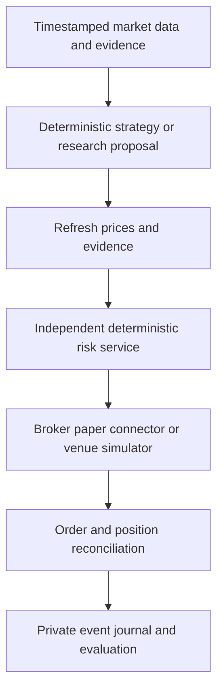

# Architecture and implementation roadmap

## Current boundary

One deterministic strategy is operational in historical replay. CSV input flows through the unchanged VWAP engine into private reports and an atomic SQLite journal. Public Polymarket discovery is independently callable. Research providers expose assessments only and have no execution credentials or broker capability.

This is a framework foundation, not an operational trading service. The SQLite database stores completed research runs, not durable open-order/account recovery state. Export files and the database do not form one filesystem/database transaction; after an export failure, inspect the journal before retrying.

## Target architecture

### Connector contracts

Keep three capabilities separate: market data, research evidence, and order execution. Every data event must retain venue, instrument ID, source timestamp, observation timestamp and provenance. Each connector declares supported asset class, order types, authentication needs, and whether execution is simulated. Unknown capabilities fail closed.

Public discovery is not executable pricing. Before Polymarket simulation, collect CLOB snapshots and updates, outcome token IDs, tick/minimum sizes, fee rules, lifecycle status and resolution rules. Preserve raw payloads for schema/version changes. Current Gamma discovery is a bounded single page, not an exhaustive market crawler.

### Strategy integration

VWAP is for regular-session equity candles. It cannot be reused unchanged for binary event contracts. Extract a proposal API from the VWAP engine only after regression parity against the pinned original: proposed side, signal timestamp, stop, expiry and invalidation. The risk service then sizes using fresh account state and an executable quote.

All rules stay in code with versioned policy. The research process must not have filesystem permission to change approved policy or access order credentials. Daily loss limits, open-order exposure and portfolio caps belong outside model calls. Risk monitoring runs independently of scheduled research. Research proposals expire and require revalidation.

### Persistence

Use transactional idempotency keys for order intents, broker acknowledgments, partial fills and reconciliation. A timeout after submission means unknown outcome, not permission to resubmit. Store sensitive account state outside GitHub. Reconstruct and reconcile before restarting execution.

## Ordered milestones

1. **Data and replay:** add exchange-calendar-aware equity ingestion, real historical datasets and train/test partitions. Keep the current synthetic fixture solely for regression checks.
2. **Paper execution:** select Alpaca's direct paper API or Interactive Brokers with Nautilus; do not assume Nautilus includes an Alpaca adapter. Implement read-only account/quote checks before paper orders. Extract VWAP proposals and preserve historical parity.
3. **Polymarket research:** discovery, order-book recording, event lifecycle and a depth/latency/fee-aware simulator. No wallet needed for this stage. Confirm venue/account eligibility separately before any live deployment.
4. **ML evaluation:** compare a fixed deterministic baseline, local classifier, and optional Jev/LLM evidence cascade. Use chronological train/calibration/test periods with overlapping-label purging and train-only preprocessing. Track all experiments, including failed ones.
5. **Engine migration:** evaluate a pinned Nautilus release and its LGPL obligations before adopting it. Test market data, fills, reconciliation and binary settlement; do not treat documentation as an integration test.

Promotion requires reproducible evaluation after realistic costs and operational failure testing. Trade count or a week of good results alone is insufficient. Track returns/drawdown/turnover, calibration, abstention, inference cost and order errors. Wallet-copy experiments require forward selection and realistic observation delay; social-media profit screenshots are not validation.

## References

- https://docs.polymarket.com/api-reference/predictions/overview
- https://nautilustrader.io/docs/latest/integrations/polymarket/
- https://nautilustrader.io/docs/latest/integrations/
- https://docs.alpaca.markets/us/docs/paper-trading
- https://github.com/YizhiSong/FriesTrader
- https://github.com/TauricResearch/TradingAgents

Reviewed during project design, October 2026. Recheck provider contracts before implementing or deploying an adapter.
