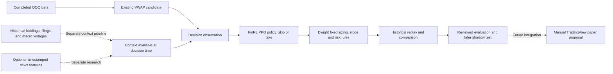

# FinRL decisions above QQQ VWAP

FinRL can train an optional policy that accepts or skips Dwight's existing VWAP candidates. FinRL supplies reinforcement learning algorithms and research infrastructure. Fundamental information must arrive through a separate data pipeline; installing FinRL does not produce earnings analysis, economic forecasts or evidence of an advantage.

This integration is research scaffolding. There is no trained FinRL model, no measured improvement on real QQQ data, and no connection to a trading account. The public Hugging Face dashboard continues to show its existing synthetic classifier experiments. The new code does not change its results or deployment.

## How the pieces connect



VWAP defines when an opportunity exists. A trained policy could learn whether the observed context makes that opportunity worth taking under the replay assumptions. It cannot create a trade outside the candidate rules, trade another symbol, open a short, change a stop or increase the configured risk budget. Skipping a candidate leaves the same session rules in effect.

The user's selected account is **Paper Trading by TradingView**. This research module neither places orders there nor switches the account to Alpaca. TradingView documents that Pine strategies cannot place orders into its built-in paper account. Any later manual proposal and fill-import workflow remains separate work. [TradingView strategies FAQ](https://www.tradingview.com/pine-script-docs/faq/strategies/#can-i-connect-my-strategies-to-my-paper-trading-account)

## Research interface

`dwight.finrl.DecisionReplay` wraps Dwight's candidate and replay logic. It accepts a sequence of completed bars, a strategy configuration, and optional `PointInTimeContext`. It is restricted to QQQ and long entries. The default experiment uses technical observations only; supplying nonempty context feature names makes timely context a prerequisite for taking a candidate.

The interface is:

```python
replay = DecisionReplay(bars, config=config, context=context, synthetic=True)
observation, info = replay.reset()
observation, reward, terminated, truncated, info = replay.step(action)
names = replay.observation_names
result = replay.report()
```

An action of `0` means skip; `1` means take. Each step advances from one candidate decision to the next, or to the end of the replay. The step returns five values and `truncated` is false. Existing next-bar fills, stop handling, position sizing and other replay rules remain responsible for simulated outcomes. Candidate timing and the actual candidate path depend on earlier decisions; evaluation must replay every policy independently.

Reward is the change in realized equity divided by initial capital between flat candidate boundaries. It includes the effects represented by the replay, including configured trading costs. PPO uses `gamma=1` so variable time gaps between candidates are not treated as equal units of financial time discounting. This does not remove the limitations of an OHLC simulator or model order-book fills. Drawdown and operational constraints must be evaluated separately from cumulative reward. A retained candidate can still fail the engine's entry checks; use the trade ledger to count actual simulated fills.

The default `synthetic=True` provenance is conservative. Pass `synthetic=False` only for real input and retain its dataset manifest separately; the adapter still labels that data caller supplied and unverified. No setting grants runtime promotion.

`make_gym_env(replay)` lazily loads Gymnasium and NumPy. Its action space is `Discrete(2)`. An optional training bridge calls:

```python
env = make_gym_env(training_replay)
train_ppo(env, output_path, total_timesteps=2048, seed=0)
```

The bridge uses FinRL's actual `DRLAgent` and its Stable Baselines3 PPO backend with `MlpPolicy`, CPU execution, `gamma=1`, `n_steps=64` and `batch_size=64`. The default training length is a small engineering check, not a proposed research budget or a sufficient training run. Policy action probabilities must not be presented as calibrated probabilities of profitable trades.

The caller is responsible for providing appropriately partitioned bars and context. There is currently no full chronological training, validation and final-test orchestrator for this integration. A training call does not approve or promote a model. Its provenance report must retain the research status and absence of measured market advantage.

`examples/finrl_smoke.py` exercises synthetic skip and take controls through the replay without installing FinRL. It is an integration demonstration, not a trained reinforcement learning experiment. API-boundary tests can establish that the bridge calls the expected methods; they cannot establish that the full upstream dependency stack installs or a policy learns successfully. Actual Gymnasium checking, when recorded in a test run, establishes that interface only. No completed FinRL/PPO training run is claimed here.

## Local verification

Run the standard-library contract smoke with:

```sh
python -m examples.finrl_smoke --output runs/finrl-smoke
python -m unittest tests.test_context tests.test_finrl -v
```

The optional `rl-env` extra supplies Gymnasium and NumPy only. The separate
`requirements-rl-env.lock` records the environment used for the actual
Gymnasium checker and adapter tests. It does not install FinRL, SB3 or PyTorch.
The core tests run without these optional dependencies; Gymnasium-specific
checks are skipped when they are absent.

The synthetic smoke compares fixed take-all, skip-all and expired-context
behaviors. Its dollar results describe invented data and must not be presented
as a policy's trading performance. The training-boundary unit test uses an
exact-signature fake of the reviewed FinRL API; it is not a training run.

## Fundamental context for an ETF

QQQ context should describe the portfolio and the economic conditions relevant to it. It is not equivalent to assigning one company's fundamentals to the ETF.

| Feature group | Example inputs | Required historical evidence |
| --- | --- | --- |
| Constituents | Earnings growth, margins, guidance changes or earnings event exposure | Membership and portfolio weights valid at the decision date; original filing or release versions |
| Macro conditions | Interest rates, inflation releases, growth indicators and scheduled announcements | Release timing, the vintage actually available then, and revision history |
| News, if later tested | Relevant article counts, age and frozen sentiment or event outputs | Provider, exact text version, publication time, receipt time and processing availability |

SEC's APIs provide submissions and financial statement facts. They do not automatically construct a point-in-time QQQ feature set. Historical weighting, accession/version selection, units, missing values and publication availability require explicit processing. An earnings-surprise feature also needs an archived pre-release expectation source; the actual earnings figure alone is insufficient. [SEC EDGAR APIs](https://www.sec.gov/search-filings/edgar-application-programming-interfaces)

FRED's default view describes the past using information available today. ALFRED real-time periods allow retrieval of information known at a historical date. Macro features need those vintages and the actual intraday release availability relevant to the five-minute decision. [FRED and ALFRED real-time periods](https://fred.stlouisfed.org/docs/api/fred/realtime_period.html)

Every feature snapshot needs an explicit schema, an availability timestamp and source provenance. Availability must reflect the latest relevant publication, receipt and processing time. Keep observation period, publication time and usable time distinct. Do not join by quarter-end or use today's revised facts, holdings or news text for an earlier decision. Missing and stale context must be visible; it must not silently become a neutral economic reading or allow a context-dependent trade.

`PointInTimeContext` is an ingestion boundary for prepared snapshots, not a SEC, news or FRED downloader. No fundamental data provider is connected by this change. Price transformers and news transformers, described in [the transformer research plan](transformer-research.md), can later contribute features through a versioned context contract. They are not prerequisites for PPO and are not executing here.

`PointInTimeContext.from_path(path)` accepts this exact JSON structure. Values below are invented schema examples, not macro observations:

```json
{
  "schema_version": 1,
  "symbol": "QQQ",
  "feature_names": ["macro_score"],
  "snapshots": [{
    "symbol": "QQQ",
    "published_at": "2026-09-28T12:30:00Z",
    "available_at": "2026-09-28T12:31:00Z",
    "expires_at": "2026-09-28T20:00:00Z",
    "source": "synthetic_schema_example",
    "features": {"macro_score": 0.0}
  }]
}
```

Each record is a complete feature snapshot. Use a new snapshot when any input changes, with feature lineage retained in the upstream dataset. The latest available snapshot is valid only until its expiry; expired data never falls back to an older vintage. An absent snapshot has a separate availability mask and blocks a context-dependent take. Fit any scaling on training data only, persist those transformations, and apply them consistently to all later partitions.

## How to test whether it adds value

All arms must use the same long-only QQQ candidate rules, initial capital, feed, session calendar, position sizing, stops, trading costs and permitted information. Comparing a long-only RL policy with an unrestricted long-and-short baseline would not isolate the policy's contribution.

| Arm | Decision rule | Purpose |
| --- | --- | --- |
| VWAP baseline | Accept every eligible long candidate | Establish the unchanged strategy control |
| VWAP with simple context rule | Apply a fixed, predeclared context filter | Test whether a simple rule captures the useful information |
| VWAP with classifier | Fit a small supervised model using the same available features | Test whether reinforcement learning is needed |
| VWAP with FinRL PPO | Learn skip or take from the same available features | Measure the incremental effect of the learned policy |

Also compare PPO with and without context. That separates the contribution of additional information from the choice of learning algorithm. Record every trial, seed, data snapshot, feature transformation and reward definition.

Split by chronological sessions before fitting anything. Fit preprocessing on training data only. Select the policy, context choices and training duration using validation periods. Exclude boundary-spanning outcomes and apply a declared embargo when overlapping horizons require one. Reserve a later final holdout and use walk-forward periods to inspect different regimes. Repeatedly adjusting the design after viewing a holdout consumes that holdout.

Report net return, drawdown, trade count, exposure, turnover, skip rate, context coverage, decision latency and operating cost. Show each arm's equity and drawdown on the same time axis, with uncertainty estimates where sample size permits. Training reward is not a substitute for these outcomes. Run multiple training seeds and disclose their distribution rather than selecting the best seed after seeing test performance.

The first real-data comparison, full training/evaluation pipeline, sensitivity checks and later forward shadow experiment remain unfinished. The existing 12-hour, 24-hour, 48-hour and one-week reporting plans do not become evidence of a trained PPO policy because this adapter exists.

## Upstream source and installation boundary

The reviewed FinRL source is pinned to `e60e26e4870f00fbc704c6297edfd9d81816b3d3`, verified from the public repository on October 3, 2026. This is a source reference, **not a tested environment lock**. Keep it outside Dwight's core, broker and public Space dependencies.

For a separate research environment, the upstream requirement is:

```text
FinRL @ git+https://github.com/AI4Finance-Foundation/FinRL.git@e60e26e4870f00fbc704c6297edfd9d81816b3d3
```

Use an isolated Python 3.11 environment and resolve the complete upstream dependencies before claiming support. Verify `from finrl.agents.stablebaselines3.models import DRLAgent`, run SB3's `check_env` on the custom environment, perform a bounded CPU train/save/load/predict check, then record the resolved versions in a reproducible lock. None of that is an instruction to install packages into the running service or automatically launch a paid job.

The full install is currently **unverified**. FinRL's package initializer imports its train, test and trade modules, which pull in data and Alpaca dependencies. Its agent module imports `CrossQ` and `TQC` from `sb3_contrib` even when only PPO is requested. CrossQ appeared in version 2.4.0; SB3 and contrib must have compatible versions. The upstream Poetry metadata and requirements file are broad and differ, so a SHA alone cannot freeze the environment. [Pinned package metadata](https://github.com/AI4Finance-Foundation/FinRL/blob/e60e26e4870f00fbc704c6297edfd9d81816b3d3/pyproject.toml), [requirements](https://github.com/AI4Finance-Foundation/FinRL/blob/e60e26e4870f00fbc704c6297edfd9d81816b3d3/requirements.txt), [contrib changelog](https://sb3-contrib.readthedocs.io/en/master/misc/changelog.html)

We intentionally use only FinRL's model construction and training boundary. Its default stock environment uses continuous share actions, current-state fills and daily annualization assumptions. Its preprocessing backfills missing values, which can introduce future information. Its evaluation helpers assume stock-specific methods and include an older step signature. Its sample Alpaca runner can cancel account orders and does not provide Dwight's lifecycle guarantees. Dwight does not invoke those behaviors, although FinRL eagerly imports some of these modules. [Pinned DRLAgent](https://github.com/AI4Finance-Foundation/FinRL/blob/e60e26e4870f00fbc704c6297edfd9d81816b3d3/finrl/agents/stablebaselines3/models.py), [stock environment](https://github.com/AI4Finance-Foundation/FinRL/blob/e60e26e4870f00fbc704c6297edfd9d81816b3d3/finrl/meta/env_stock_trading/env_stocktrading.py), [preprocessor](https://github.com/AI4Finance-Foundation/FinRL/blob/e60e26e4870f00fbc704c6297edfd9d81816b3d3/finrl/meta/preprocessor/preprocessors.py), [paper runner](https://github.com/AI4Finance-Foundation/FinRL/blob/e60e26e4870f00fbc704c6297edfd9d81816b3d3/finrl/meta/env_stock_trading/env_stock_papertrading.py)

The supported custom-environment interface and discrete PPO action space are documented by [Stable Baselines3](https://stable-baselines3.readthedocs.io/en/master/guide/custom_env.html). Its [PPO documentation](https://stable-baselines3.readthedocs.io/en/master/modules/ppo.html) recommends CPU execution for small policies without image convolutions. A GPU or transformer model is not required for this first numeric experiment.

## FinRL, FinRL-X and licensing

The original FinRL repository now identifies itself as an educational and research framework and points production development toward the separate FinRL-Trading repository, branded FinRL-X. This does not require Dwight to migrate its whole architecture. The bounded adapter uses original FinRL for research while keeping Dwight's rules and account workflow. [Official FinRL positioning](https://github.com/AI4Finance-Foundation/FinRL), [FinRL-Trading](https://github.com/AI4Finance-Foundation/FinRL-Trading)

Original FinRL is MIT licensed. FinRL-Trading carries Apache 2.0. These allow commercial use subject to their conditions; retain the relevant copyright and license notices when distributing their code. Review dependency, data, news and model-weight terms separately. FinRL's trademark notice does not grant use of its brand as Dwight's own product identity. [FinRL license](https://github.com/AI4Finance-Foundation/FinRL/blob/e60e26e4870f00fbc704c6297edfd9d81816b3d3/LICENSE), [FinRL-Trading license](https://github.com/AI4Finance-Foundation/FinRL-Trading/blob/master/LICENSE)
