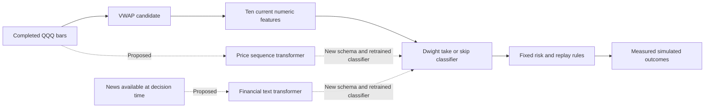

# Transformer features for Dwight

Dwight currently uses a logistic regression classifier to accept or reject candidates produced by the VWAP strategy. The public Hugging Face Space trains and evaluates that classifier on generated prices. No transformer is connected, no news source is connected, and no transformer contribution to trading performance has been measured.

The proposed research has two equal parts. A price model could summarize a longer sequence of completed bars. A text model could summarize financial news that was actually available at the decision time. These are hypotheses about additional information. Neither model replaces the VWAP candidate rules or the deterministic risk rules.

## Where the new information would enter

The existing ten features describe direction, distance from VWAP and EMA, volatility, candle body, relative volume, session time, stop distance and confirmed structure. Dwight's output estimates the probability of a positive net result under the training labels and replay assumptions. It is not a guarantee or a complete measure of expected return.

Today's model loader requires the exact `vwap-candidate-v1` feature schema. Connecting a transformer requires a new schema version, fitted preprocessing, a newly trained classifier and a reviewed release. Adding extra columns to an existing artifact is not a valid integration.

## Price sequences

The first experiment would use a fixed context window ending at the last completed five minute bar. The model could add a forecast median change scaled by observed ATR, a forecast interval width and alignment with the candidate direction. All transformations must use information available before the decision. Known future calendar fields may be permitted by the experiment contract; realized future prices, volume and events may not.

Chronos 2 supports forecasting with quantile outputs and covariates. Its model card declares Apache 2.0. TimesFM 2.5 provides another forecasting candidate with point and quantile outputs, and its card also declares Apache 2.0. These statements describe capabilities and declared licenses, not QQQ performance. Sources checked on October 2, 2026: [Chronos 2 model card](https://huggingface.co/amazon/chronos-2), [TimesFM 2.5 model card](https://huggingface.co/google/timesfm-2.5-200m-pytorch).

Begin with one frozen model. Testing an alternative consumes a separate research trial and must be recorded. Forecast accuracy should beat a last price forecast on later sessions before a more complex connection earns further attention. Even an accurate forecast can lose money after spread, slippage and fees. A forecast interval also does not provide the probability of hitting a target before a stop.

Keep the market feed and adjustment policy consistent with the deployed strategy. Treat overnight gaps and early closes explicitly rather than stitching every recorded bar into a uniformly spaced sequence. Compare transformer features with a cheap lagged return and volatility extension so that the benefit of extra history is not mistaken for the benefit of a transformer.

## News context

Record article identifiers, provider, publication time, first receipt time, revisions and the original text snapshot. Eligibility is based on when the bot could first access that exact version, including processing latency. A later article edit cannot replace the earlier snapshot in a historical decision. If first receipt evidence is missing, report that limitation and use a conservative availability rule.

FinBERT is an English financial sentiment classifier with positive, negative and neutral outputs. It does not extract earnings surprise or reliably classify every market event. The inspected Hugging Face card and file list do not declare a weights license. The upstream source repository has an Apache 2.0 license; that alone is not treated here as confirmation of the Hub artifact's licensing. Confirm the selected weights before commercial integration. Sources: [FinBERT model card](https://huggingface.co/ProsusAI/finbert), [Hub file list](https://huggingface.co/ProsusAI/finbert/tree/main), [upstream license](https://github.com/ProsusAI/finBERT/blob/master/LICENSE).

Possible inputs to Dwight are sentiment scores, article age, deduplicated article count and a missing news indicator. News about a constituent can be weighted by historical QQQ membership and weights only when those records are available. Applying today's constituents to older dates introduces selection bias. Macro news needs its own relevance rules. Sentiment about a company does not automatically imply the same direction for QQQ.

Compare sentiment features with an article count and age control. This distinguishes information in the language from a change caused simply by knowing that news arrived. Missing coverage must remain visible rather than being encoded as neutral sentiment. News text is data and must never issue instructions, change risk policy or obtain broker credentials.

## A comparison that can establish added value

| Experiment | Features | Current evidence |
| --- | --- | --- |
| Dwight alone | Existing ten features | Synthetic demonstration only |
| Dwight plus price context | Existing features and sequence outputs | Not measured |
| Dwight plus news context | Existing features and timely news summaries | Not measured |
| Dwight plus both | Both feature groups | Not measured |

Create one chronological candidate dataset and publish its split dates and eligibility rules before tuning. Measure classification on the same eligible candidate cohort. Fit scaling and classifiers on training data. Select thresholds and research choices on validation sessions. Remove training labels whose exit outcomes cross into the next partition and apply a predeclared embargo appropriate to overlapping label horizons. Merely shuffling rows into a holdout is not acceptable.

Independently replay each policy with identical capital, fees, slippage, feed, calendar, sizing and exits. Filtering trades changes exposure and can change which subsequent signals are executable, so portfolio comparisons must not just delete losing trades from one completed ledger. Show the VWAP and simple volume baselines beside the learned policies.

Measure calibration and Brier score alongside net return after costs, drawdown, turnover, trade count and the amount of data observed. Show inference latency, failure rate and extra operating cost. Use paired session or block resampling to describe uncertainty when the sample supports it. A short period with few trades should be described as inconclusive.

An ablation removes one new feature group at a time. Simpler history and news count controls test whether the additional model complexity is warranted. Keep a final holdout untouched until the design is fixed. Changing the design after viewing it requires another holdout or nested walk forward evaluation, not repeated claims against the same test set.

Inspect foundation model pretraining provenance and available cutoff evidence. Unknown overlap with historical financial data is a limitation even when Dwight's own train and test split is correct. Newly collected forward observations help reduce this uncertainty. Attention maps can illustrate model behavior; they do not establish a causal explanation for a trade's result.

## What the Space should show

Current strategy curves and metrics come from actual saved synthetic experiment results. Proposed connectors use distinct visual states and show contribution as **not measured**, with no invented improvement percentage, forecast or transformer equity curve. A connection diagram explains where new inputs would enter. Selecting a connector displays its input requirements, candidate models, license evidence, comparison design and limitations.

After a real experiment exists, show the four policies on the same time axis with equity, drawdown, trade markers and complete sample counts. Keep historical simulation, forward shadow decisions and confirmed paper fills in separate views. Chart styling can follow a dark trading terminal while data remains our generated fixture or an appropriately licensed source.

## Before a connector can run

Freeze code, model revision, tokenizer, transformations, feature schema, data snapshots and checksums. Review weights, code, market data and news rights separately. Measure memory and latency before choosing where inference runs. Hosted training or an inference endpoint is an operational option, not evidence of better predictions.

If a required feature is missing or arrives too late, the new policy abstains unless a separately evaluated fallback is explicitly configured. No model can adjust its own risk budget, overwrite protective exits or approve its own deployment. The current public Space remains a research demonstration with no transformer download, model inference service, broker connection or order capability.
